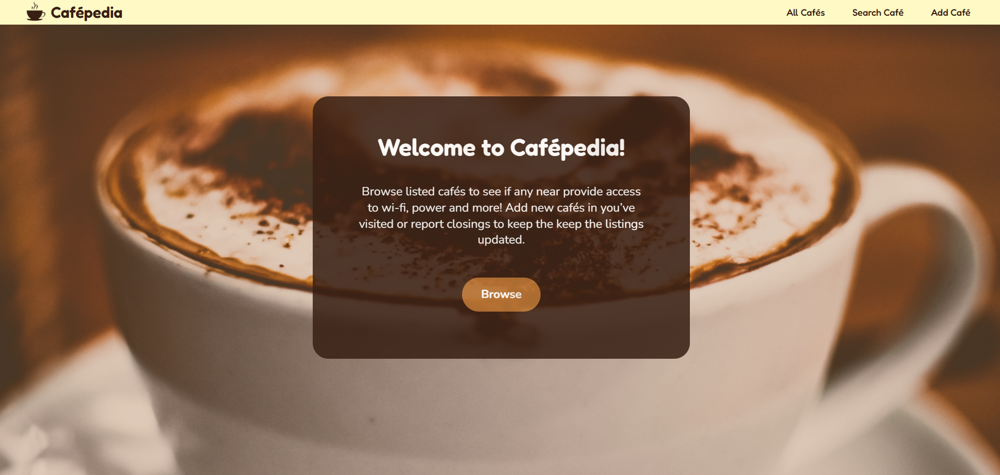
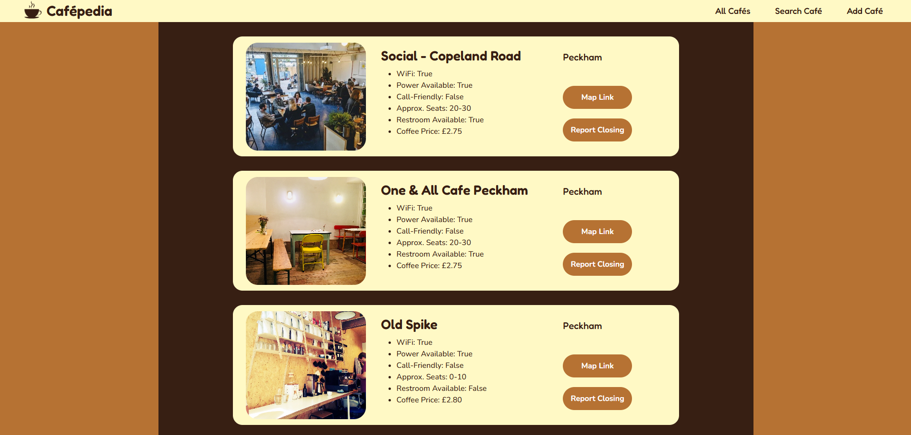
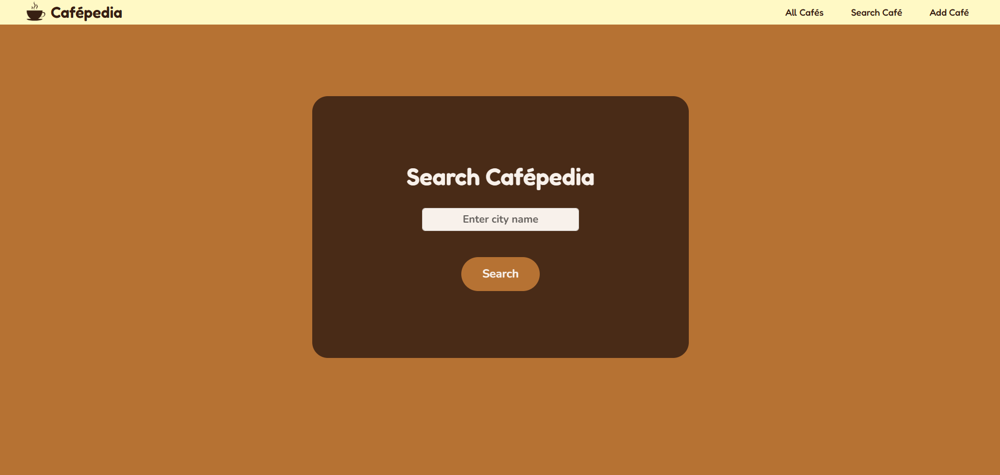

#Cafépedia
___
A basic little cafe-database-website I made for a course project. It displays data from a cafe.db file, showing the user information such as if there's power and wifi available, seating, restrooms and so on. 
It also lets the user add/remove entries as well, however user's can't add two locations with the same name. The site should also display properly on multiple screensizes. 

#How It's Made:
___
Tech used: HTML, CSS, Python, Flask/Bootstrap, SQLAlchemy, wtforms, flask_wtf 

This was a project from an online course which builds upon a much earlier lesson on making APIs. Project simple retrieves all listings from a local "cafes.db" file and displays them on the "All Cafes" page. The same template for this page is also used to display the results from the "Search Cafe" page, which allows users to search City Names and retrieve any matched found in the database. 

All routing is handled by Flask, styling is a combination of Bootstrap and CSS. 

#To use:
___
Beyond copying the files and installing the "requirements.txt" file, flask_bootstrap can be a little peculiar. Trying to download this via PyCharm kept failing, requiring the user to instead install "Bootstrap-Flask" in their terminal to get flask_bootstrap to run properly. The user will also need to set a "FLASK_KEY" environmental variable for the program to run, as it's what flask will pull and use as the Secret Key for CSRF protection.

#Lessons Learned:
___
This was a project from an online course which builds upon a much earlier lesson on making APIs. We were required to make a Café website around the .db file provided in that project. The preset requirements of the file are why some of the things were made to function the way they do (no log-in or parent/child relationship with posts, so on. I started by making the design in Canva and finding a some free image/graphics I would be able to use. From there, I built my website page-by-page to match my design as closely as I could. I decided to go with the coffee/caramel/cream color scheme for the whole Café theme. 

The biggest challenges here are largely CSS. Namely getting everything to align properly the way I envisioned when the website was designed initially in Canva. I learned a lot from this, however, like writing my own media-queries where I didn't want to use Boostrap's pre-built option at one point. I also learned that Bootstrap tends to override your own media queries. Overall this site was a great lesson not just in building a app/site with frameworks like bootstrap/flask, but to also work with and overcome their inevitable limitations as your program goes beyond what they provide you. 
